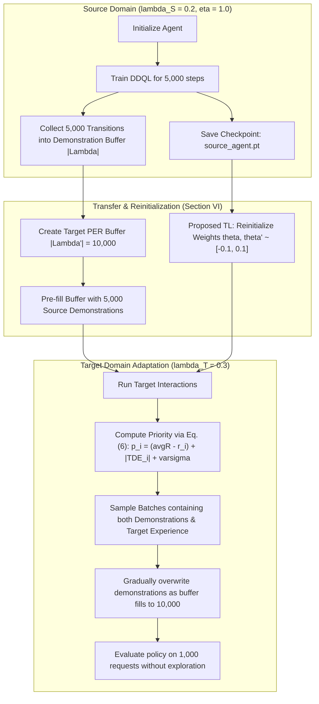

# System Data Flow & Lifecycle Architecture

This document describes the exact step-by-step data flow throughout the **SMDP Edge Caching Framework**, detailing how data, states, rewards, neural tensors, and network packets transition between **`simulator-go`** and **`agent-python`**.

---

## 1. High-Level Architectural Flowchart

```mermaid
sequenceDiagram
    autonumber
    participant User as User / Script
    participant Agent as Python Agent (agent-python)
    participant Buffer as SumTree PER Buffer
    participant QNet as PyTorch MLP (Q-Network)
    participant gRPC as gRPC Channel (:50051)
    participant Engine as Go Simulator (simulator-go)
    participant Cache as Cache Memory & Evictor

    User->>Agent: Launch experiment (main.py)
    Agent->>Engine: Auto-launch bin/server.exe (if inactive)
    Agent->>gRPC: ResetRequest(seed, lambda, eta)
    gRPC->>Engine: Reset CacheEngine & RNG
    Engine-->>gRPC: StateResponse s(0)
    gRPC-->>Agent: Initial state vector s(0) in R^251

    loop Each SMDP Decision Epoch t
        Agent->>QNet: Forward pass Q(s, a; theta)
        QNet-->>Agent: Q-values [Q(s, 0), Q(s, 1)]
        Agent->>Agent: Epsilon-greedy action selection a in {0, 1}
        Agent->>gRPC: StepRequest(action=a)
        
        Note over Engine,Cache: Step Execution in Go Engine
        Engine->>Engine: Sample inter-arrival: tau = -ln(U)/lambda
        Engine->>Engine: Advance clock: t = t + tau
        Engine->>Engine: Update freshness: h^f(t) = (t - w_g)/w_l
        Engine->>Engine: Update non-linear utility: y_f(t)
        
        alt Action a = 1 (Cache File)
            Engine->>Cache: Evict lowest utility files until fits
            Cache->>Cache: Insert requested file f_r
        end
        
        Engine->>Engine: Calculate Worth: W(t) = sum(b_f * d_f * y_f)
        Engine->>Engine: Calculate Reward: r(t) = W(t) - Mem(t)*100
        Engine->>Engine: Sample next requested file: f_{r+1} ~ Zipf(eta)
        Engine-->>gRPC: StepResponse(next_state s', reward r, tau, is_hit, utility)
        gRPC-->>Agent: (s', r, tau, is_hit, utility)
        
        Agent->>Buffer: Store transition (s, a, r, s', tau)
        Agent->>Agent: Accumulate n-step trajectory (n=3)
        
        opt When Buffer Size >= Batch Size (64)
            Buffer->>Agent: Sample prioritized mini-batch using P(i) = p_i^alpha / sum(p^alpha)
            Agent->>QNet: Compute multi-task loss J = J_DQ + lambda_1*J_n + lambda_2*J_E + lambda_3*J_L2
            Agent->>QNet: Backpropagate loss & Adam optimizer step
            Agent->>Buffer: Update priorities using Eq. 6: p_i = (avgR - r_i) + |TDE_i| + varsigma
        end
        
        opt Every zeta = 100 Training Steps
            Agent->>QNet: Synchronize weights: theta' <- theta
        end
    end

    Agent->>User: Save JSON telemetry to data/results/ & Checkpoints
```

---

## 2. Detailed Data Transformation Pipeline

```
 ┌────────────────────────────────────────────────────────────────────────────────────────┐
 │ 1. REQUEST GENERATION (simulator-go)                                                  │
 │                                                                                        │
 │  Input: Seed, Request Rate lambda, Zipf Skewness eta                                   │
 │  Formulae:                                                                             │
 │    • Inter-arrival interval:  tau = -ln(U) / lambda                                    │
 │    • Zipf Probability:        p_f = (1 / f^eta) / sum(1 / k^eta)                       │
 │    • Cumulative Time:         t_{new} = t_{old} + tau                                  │
 └───────────────────────────────────────────┬────────────────────────────────────────────┘
                                             │ (f_r, tau, t)
                                             ▼
 ┌────────────────────────────────────────────────────────────────────────────────────────┐
 │ 2. CACHE ACCESS, FRESHNESS & UTILITY UPDATE (simulator-go)                            │
 │                                                                                        │
 │  For each cached file f:                                                               │
 │    • Freshness:   h^f(t) = (t - w_g^f) / w_l^f in [0, 1]                               │
 │    • Utility:     y_f(t) = (-Curve * exp(h^f(t)) + UT_max + Curve) * i_f               │
 │                                                                                        │
 │  Hit Determination:                                                                    │
 │    • is_hit = Cached[f_r]                                                              │
 │    • If hit: utility_gained = y_{f_r}(t); d_{f_r} incremented in sliding window N=100  │
 │    • If miss: utility_gained = 0.0                                                     │
 └───────────────────────────────────────────┬────────────────────────────────────────────┘
                                             │ Cache state & metrics
                                             ▼
 ┌────────────────────────────────────────────────────────────────────────────────────────┐
 │ 3. REWARD CALCULATION (simulator-go)                                                  │
 │                                                                                        │
 │  • Unoccupied Cache Memory Ratio:                                                      │
 │      Mem(t) = (Capacity - sum(b_f * z_f)) / Capacity in [0, 1]                         │
 │                                                                                        │
 │  • Total Cache Worth:                                                                  │
 │      W(t) = sum_{f=1}^F b_f(t) * d_f(t) * y_f(t)                                      │
 │                                                                                        │
 │  • SMDP Instant Reward:                                                                │
 │      r(t) = W(t) - Mem(t) * 100                                                        │
 └───────────────────────────────────────────┬────────────────────────────────────────────┘
                                             │ State struct & reward
                                             ▼
 ┌────────────────────────────────────────────────────────────────────────────────────────┐
 │ 4. gRPC SERIALIZATION OVER TCP PORT 50051                                             │
 │                                                                                        │
 │  Protobuf Message: StateResponse                                                       │
 │    double            mem            = 1;   // Scalar unoccupied ratio                  │
 │    repeated double   d              = 2;   // F=50 request counts                      │
 │    repeated double   y              = 3;   // F=50 current utilities                   │
 │    repeated double   z              = 4;   // F=50 file sizes (MiB)                    │
 │    repeated int32    b              = 5;   // F=50 binary cached flags                 │
 │    int32             requested_file = 6;   // Requested file index f_r in [0, F-1]     │
 │    double            current_time   = 7;   // Global continuous timestamp              │
 └───────────────────────────────────────────┬────────────────────────────────────────────┘
                                             │ Binary protobuf stream
                                             ▼
 ┌────────────────────────────────────────────────────────────────────────────────────────┐
 │ 5. PYTHON STATE VECTOR ENCODING (agent-python)                                        │
 │                                                                                        │
 │  Numpy State Array s(t) in R^251:                                                      │
 │   Index 0:         Mem(t) (Scalar)                                                     │
 │   Indices 1..50:   d_1 .. d_50 (Window popularity counts)                              │
 │   Indices 51..100: y_1 .. y_50 (Current utility values)                                │
 │   Indices 101..150: z_1/1000 .. z_50/1000 (Normalized sizes)                           │
 │   Indices 151..200: b_1 .. b_50 (Binary cache presence)                                │
 │   Indices 201..250: One-Hot vector of requested file f_r                               │
 └───────────────────────────────────────────┬────────────────────────────────────────────┘
                                             │ Float32 Tensor s(t)
                                             ▼
 ┌────────────────────────────────────────────────────────────────────────────────────────┐
 │ 6. NEURAL NETWORK INFERENCE (agent-python)                                            │
 │                                                                                        │
 │  Architecture: 2-layer MLP (16 hidden units, ReLU, uniform init [-0.1, 0.1], bias 0.1)│
 │    Layer 1: Linear(251 -> 16) + ReLU                                                   │
 │    Layer 2: Linear(16 -> 2)                                                            │
 │    Output:  [Q(s, a=0), Q(s, a=1)]                                                     │
 │                                                                                        │
 │  Action Selection:                                                                     │
 │    • Exploration: with probability epsilon, action = random(0, 1)                      │
 │    • Exploitation: action = argmax_a Q(s, a; theta)                                    │
 └───────────────────────────────────────────┬────────────────────────────────────────────┘
                                             │ Action a in {0, 1}
                                             ▼
 ┌────────────────────────────────────────────────────────────────────────────────────────┐
 │ 7. ACTION EXECUTION & LOWEST-UTILITY EVICTION (simulator-go)                           │
 │                                                                                        │
 │  If action == 1 (Admit file f_r):                                                      │
 │    While (UsedCapacity + Size(f_r) > CacheCapacity):                                   │
 │      f_victim = argmin_{f in Cached} y_f(t)   (Lowest Utility Eviction)                │
 │      Remove f_victim from cache; UsedCapacity -= Size(f_victim)                        │
 │    Insert f_r; UsedCapacity += Size(f_r)                                               │
 └───────────────────────────────────────────┬────────────────────────────────────────────┘
                                             │ Transition Feedback (s, a, r, s', tau)
                                             ▼
 ┌────────────────────────────────────────────────────────────────────────────────────────┐
 │ 8. MULTI-STEP REPLAY BUFFER & SUMTREE (agent-python)                                  │
 │                                                                                        │
 │  • n-step Return Accumulation (n = 3):                                                 │
 │      tau^{(n)} = sum_{k=1}^n tau_k                                                     │
 │      R_t^{(n)} = sum_{k=1}^n gamma^{tau^{(k)}} * r_k                                   │
 │                                                                                        │
 │  • SumTree Priority (Eq. 6):                                                           │
 │      p_i = (avgR(t) - r_i) + |TDE_i| + varsigma                                        │
 │      P(i) = p_i^alpha / sum(p^alpha),  alpha = 0.4                                     │
 │                                                                                        │
 │  • Importance Sampling Weight:                                                         │
 │      omega_i = ( (1 / |Lambda'|) * (1 / P(i)) )^beta,  beta: 0.6 -> 1.0                │
 └───────────────────────────────────────────┬────────────────────────────────────────────┘
                                             │ Prioritized Mini-Batch (Batch Size = 64)
                                             ▼
 ┌────────────────────────────────────────────────────────────────────────────────────────┐
 │ 9. MULTI-TASK LOSS & GRADIENT UPDATE (agent-python)                                   │
 │                                                                                        │
 │  Total Loss: J = J_DQ + lambda_1 * J_n + lambda_2 * J_E + lambda_3 * J_L2              │
 │                                                                                        │
 │  • 1-step SMDP Double Q-Learning Loss:                                                 │
 │      J_DQ = mean( omega_i * (r + gamma^tau * Q(s', argmax Q; theta') - Q(s, a))^2 )    │
 │                                                                                        │
 │  • n-step SMDP TD Loss:                                                                │
 │      J_n = mean( omega_i * (R^{(n)} + gamma^{tau^{(n)}} * Q(s'_{(n)}, argmax Q; theta') │
 │                           - Q(s, a))^2 )                                               │
 │                                                                                        │
 │  • Supervised Large-Margin Classification Loss (Expert Demonstrations):                │
 │      J_E = mean( max_a [ Q(s, a) + l(a_E, a) - Q(s, a_E) ] )                          │
 │                                                                                        │
 │  • L2 Regularization:                                                                  │
 │      J_L2 = 0.5 * sum(||theta||_2^2)                                                   │
 │                                                                                        │
 │  Optimization: Adam(lr = 0.0005) + Gradient Clipping (max_norm = 10.0)                 │
 │  Target Network Sync: theta' <- theta every zeta = 100 gradient steps                  │
 └────────────────────────────────────────────────────────────────────────────────────────┘
```

---

## 3. Domain Transfer Learning Workflow ($\S$ VI)



---

## 4. Telemetry and Data Persistence Flow

When an experiment completes, the data is channeled to distinct persistence formats:

| Destination Path | Data Type | Written By | Key Metrics |
| :--- | :--- | :--- | :--- |
| `data/results/drl_source_training.json` | JSON | `agent-python/evaluate.py` | Moving average reward trajectory, instant rewards, hit rate %, total utility. |
| `data/results/transfer_learning_comparison.json` | JSON | `agent-python/evaluate.py` | Step-by-step reward curves for PROPOSED TL, DQFD, DPR, and LFS. |
| `data/results/experiment_summary.json` | JSON | `agent-python/evaluate.py` | High-level comparison summary across all algorithms and domains. |
| `data/results/baseline_results.json` | JSON | `simulator-go/cmd/baseline` | Hits, misses, hit rate %, byte hit rate %, evictions, memory utilization %, latency (ns/op). |
| `data/results/parameter_sweeps.json` | JSON | `simulator-go/cmd/baseline` | Numerical series across cache sizes, request rates $\lambda$, Zipf $\eta$, file lifetimes, sizes, and importances. |
| `data/results/mdp_vs_smdp_comparison.json` | JSON | `simulator-go/cmd/baseline` | Table III reproduction (discrete MDP vs continuous SMDP hit rates). |
| `simulator-go/graphs/*.svg` | Vector SVG | `simulator-go/cmd/baseline` | 13 publication-ready SVG charts matching Figures 4, 5, 6, 7 in the paper. |
| `data/results/*.png` | PNG Plots | `agent-python/evaluate.py` | Matplotlib convergence plots matching Figures 3a and 8a in the paper. |
| `agent-python/checkpoints/*.pt` | PyTorch Weights | `agent-python/algorithms/ddql.py` | Model state dicts for online network, target network, and optimizer. |

